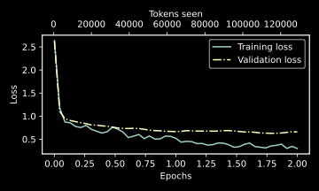
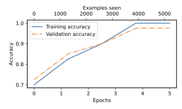

# scratchllm

A GPT-style decoder-only transformer built from scratch in PyTorch, plus
six notebooks that walk through the construction step by step: from BPE
tokenization, through attention, through the full architecture, into
pretraining, classification fine-tuning, and instruction fine-tuning.

This is a learning project, structured as a small library plus a guided
tour. The library (`scratchllm/`) is the consolidated home for every
reusable building block. The notebooks (`notebooks/`) build each piece
up by hand for pedagogy, then import from the library once a piece has
been introduced.

Built following Sebastian Raschka's [_Build a Large Language Model
(from Scratch)_](https://www.manning.com/books/build-a-large-language-model-from-scratch).

## The tour

| Notebook | What it covers |
| --- | --- |
| [`01_preprocessing.ipynb`](notebooks/01_preprocessing.ipynb) | A regex tokenizer with a hand-built vocab, then BPE via `tiktoken`. Sliding-window dataset and dataloader. Token + position embeddings. |
| [`02_attention.ipynb`](notebooks/02_attention.ipynb) | Simplified dot-product attention, then self-attention with learned Q/K/V, then causal masking, then multi-head attention. |
| [`03_architecture.ipynb`](notebooks/03_architecture.ipynb) | LayerNorm, GELU, the feed-forward network, residual connections, the transformer block, and the full GPTModel. |
| [`04_pretraining.ipynb`](notebooks/04_pretraining.ipynb) | Train from scratch on "The Verdict". Load OpenAI's published GPT-2 weights into our PyTorch model. Temperature scaling and top-k sampling. |
| [`05_classification.ipynb`](notebooks/05_classification.ipynb) | Fine-tune GPT-2 for binary spam classification: freeze the body, replace the head, train on the last-token logits. |
| [`06_instruction.ipynb`](notebooks/06_instruction.ipynb) | Supervised fine-tuning on 1,100 instructions. Alpaca-style prompts, padding-aware collation, qualitative evaluation. |

## Repo layout

```
scratchllm/        Python package, the consolidated reusable code
  model.py         LayerNorm, GELU, FeedForward, MultiHeadAttention,
                   TransformerBlock, GPTModel
  data.py          Sliding-window Dataset and DataLoader factory
  generation.py    Greedy and top-k/temperature sampling
  training.py      Training loop, loss helpers, evaluation
  weights.py       Load OpenAI's TensorFlow GPT-2 weights into PyTorch
  plotting.py      Loss-curve helper
notebooks/         The guided tour (01 through 06)
data/              the-verdict.txt and instruction-data*.json
gpt_download.py    GPT-2 weight downloader (Apache 2.0, see LICENSE)
```

## Quickstart

```bash
git clone https://github.com/<your-username>/scratchllm.git
cd scratchllm

python -m venv env-llm
source env-llm/bin/activate

pip install -r requirements.txt
pip install -e .

jupyter lab
```

The `pip install -e .` step is what lets the notebooks do
`from scratchllm import GPTModel` cleanly. After that, open any notebook
under `notebooks/`.

> **Note on the heavier notebooks.** Notebooks 04, 05, and 06 download
> the GPT-2 weights (between 500 MB and 1.5 GB depending on the model
> size) into `gpt2/` and write training checkpoints to the repo root.
> The checkpoints are gitignored. The first run of each will take a
> while; subsequent runs reuse the cached weights.

## Results

A training loss curve from pretraining on "The Verdict":



The classifier from notebook 05 reaches about 95% accuracy on held-out
spam detection in 5 epochs of fine-tuning on roughly 1,100 examples.



## Acknowledgements

* Sebastian Raschka, _Build a Large Language Model (from Scratch)_.
  This project follows the book's curriculum and uses "The Verdict" as
  its small training corpus.
* `gpt_download.py` is adapted from
  [`rasbt/LLMs-from-scratch`](https://github.com/rasbt/LLMs-from-scratch)
  and distributed under Apache 2.0. The original license header is
  preserved in the file.

## License

MIT. See [`LICENSE`](LICENSE).
