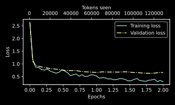
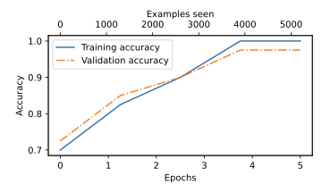

# scratchllm

A personal ML/AI cookbook. This is where I work through books, tutorials,
and my own ideas, building each piece up by hand for understanding and
keeping the parts worth reusing in a small shared library.

It started as a GPT-style transformer built from scratch, and it keeps
growing. The repo is organized one section per source material, with a
shared library (`scratchllm/`) underneath. Apple Silicon (MPS) is the
primary target, with CUDA and CPU as fallbacks.

## Sources

| Directory | Source |
| --- | --- |
| [`notebooks/`](notebooks/) | Sebastian Raschka, [_Build a Large Language Model (from Scratch)_](https://www.manning.com/books/build-a-large-language-model-from-scratch) |
| [`domain_specific/`](domain_specific/) | Guglielmo Iozzia, _Domain-Specific Small Language Models_ |

## Part 1: from scratch (`notebooks/`)

Building a decoder-only transformer from the ground up, then loading
OpenAI's GPT-2 weights into it and fine-tuning.

| Notebook | What it covers |
| --- | --- |
| [`01_preprocessing.ipynb`](notebooks/01_preprocessing.ipynb) | A regex tokenizer with a hand-built vocab, then BPE via `tiktoken`. Sliding-window dataset and dataloader. Token and position embeddings. |
| [`02_attention.ipynb`](notebooks/02_attention.ipynb) | Simplified dot-product attention, then self-attention with learned Q/K/V, then causal masking, then multi-head attention. |
| [`03_architecture.ipynb`](notebooks/03_architecture.ipynb) | LayerNorm, GELU, the feed-forward network, residual connections, the transformer block, and the full GPTModel. |
| [`04_pretraining.ipynb`](notebooks/04_pretraining.ipynb) | Train from scratch on "The Verdict". Load OpenAI's published GPT-2 weights into our PyTorch model. Temperature scaling and top-k sampling. |
| [`05_classification.ipynb`](notebooks/05_classification.ipynb) | Fine-tune GPT-2 for binary spam classification: freeze the body, replace the head, train on the last-token logits. |
| [`06_instruction.ipynb`](notebooks/06_instruction.ipynb) | Supervised fine-tuning on 1,100 instructions. Alpaca-style prompts, padding-aware collation, qualitative evaluation. |

## Part 2: domain-specific models (`domain_specific/`)

Applied recipes built mostly on the Hugging Face ecosystem, grouped by
topic.

| Notebook | What it covers |
| --- | --- |
| [`fine_tuning/bert_classifier.ipynb`](domain_specific/fine_tuning/bert_classifier.ipynb) | Fine-tune BERT for binary sentiment classification. |
| [`fine_tuning/fine_tuning.ipynb`](domain_specific/fine_tuning/fine_tuning.ipynb) | Extractive question answering with DistilBERT on SQuAD, mapping character spans to token positions. |
| [`fine_tuning/peft_lora.ipynb`](domain_specific/fine_tuning/peft_lora.ipynb) | Parameter-efficient fine-tuning with LoRA on FLAN-T5 for summarization. |
| [`fine_tuning/gpt_text.ipynb`](domain_specific/fine_tuning/gpt_text.ipynb) | Fine-tune GPT-2 for text completion on curated context-target pairs. |
| [`fine_tuning/manim_code_gen.ipynb`](domain_specific/fine_tuning/manim_code_gen.ipynb) | Fine-tune GPT-2 to generate Manim code, with an Optuna hyperparameter sweep and render-based evaluation. |
| [`fine_tuning/faiss.ipynb`](domain_specific/fine_tuning/faiss.ipynb) | Semantic search with sentence-transformer embeddings and a FAISS index. |
| [`inference/text_completion.ipynb`](domain_specific/inference/text_completion.ipynb) | Decoder-only inference with GPT-Neo 2.7B: completion, few-shot, and code generation. |
| [`onnx/onnx_format.ipynb`](domain_specific/onnx/onnx_format.ipynb) | Build a small model with ONNX's helper API and inspect the graph in Netron. |
| [`onnx/onnx_runtime.ipynb`](domain_specific/onnx/onnx_runtime.ipynb) | Run a model with ONNX Runtime across execution providers. |
| [`onnx/cpu.ipynb`](domain_specific/onnx/cpu.ipynb) | Export BERT QA to ONNX, optimize it, and benchmark CPU inference. |
| [`onnx/gpu.ipynb`](domain_specific/onnx/gpu.ipynb) | Export GPT-2 to ONNX and apply transformer GPU optimizations. |

## Repo layout

```
scratchllm/        Shared library, the consolidated reusable code
  model.py         LayerNorm, GELU, FeedForward, MultiHeadAttention,
                   TransformerBlock, GPTModel
  data.py          Sliding-window Dataset and DataLoader factory
  generation.py    Greedy and top-k/temperature sampling
  training.py      Training loop, loss helpers, evaluation
  weights.py       Load OpenAI's TensorFlow GPT-2 weights into PyTorch
  plotting.py      Loss-curve helper
notebooks/         Part 1, the from-scratch build (01 through 06)
domain_specific/   Part 2, domain-specific recipes (fine_tuning, inference, onnx)
data/              the-verdict.txt and instruction-data*.json
gpt_download.py    GPT-2 weight downloader (Apache 2.0, see LICENSE)
```

## Quickstart

The project uses [`uv`](https://docs.astral.sh/uv/) on Python 3.13.

```bash
git clone https://github.com/josephbrockw/scratchllm.git
cd scratchllm

uv sync        # creates .venv, installs everything, scratchllm editable
```

`uv sync` installs `scratchllm` in editable mode, so the notebooks can do
`from scratchllm import GPTModel` cleanly. Point your editor at the `.venv`
interpreter (in PyCharm: Settings, Project, Python Interpreter), then open
any notebook. After changing dependencies, run `uv sync` again and restart
the kernel.

> **Heavier notebooks.** Notebooks 04, 05, and 06 download the GPT-2
> weights (500 MB to 1.5 GB depending on size) into `gpt2/` and write
> training checkpoints to the repo root. Several `domain_specific`
> notebooks download Hugging Face models and datasets on first run. The
> Manim recipe also needs `ffmpeg` on your PATH. These downloads and
> outputs are gitignored.

## Results

A training loss curve from pretraining on "The Verdict":



The classifier from notebook 05 reaches about 95% accuracy on held-out
spam detection in 5 epochs of fine-tuning on roughly 1,100 examples.



## Acknowledgements

* Sebastian Raschka, _Build a Large Language Model (from Scratch)_. Part 1
  follows the book's curriculum and uses "The Verdict" as its small
  training corpus.
* Guglielmo Iozzia, _Domain-Specific Small Language Models_. Part 2 works
  through the book's applied recipes.
* `gpt_download.py` is adapted from
  [`rasbt/LLMs-from-scratch`](https://github.com/rasbt/LLMs-from-scratch)
  and distributed under Apache 2.0. The original license header is
  preserved in the file.

## License

MIT. See [`LICENSE`](LICENSE).
